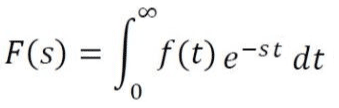
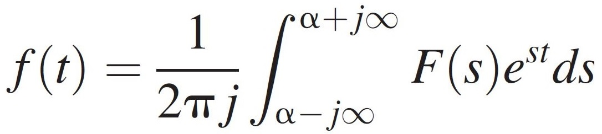

# laplace-transform-s-domain
The Laplace Transform is used to convert a continuous time domain(t) into a complex frequency domain(S), making differential equations easier to solve. 

The formula
---

To convert the S domain back into the T domain, the following formula is used:
---

This Python script finds the S domain of the differential equation. Currently, this script only works with simple, homogeneous equations. I plan on adding support for cauchy-euler equations, nonhomogeneous equations later, and inverse transformation later.

